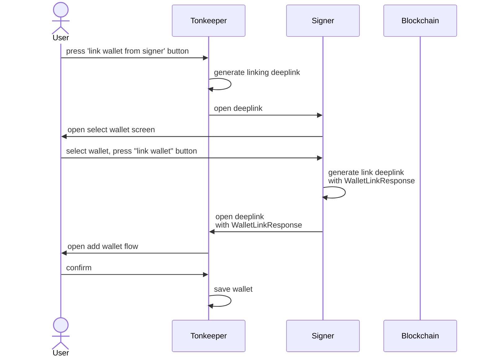
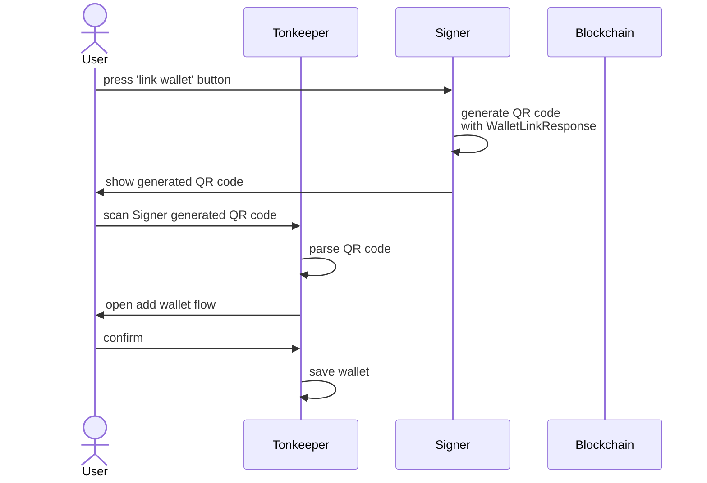
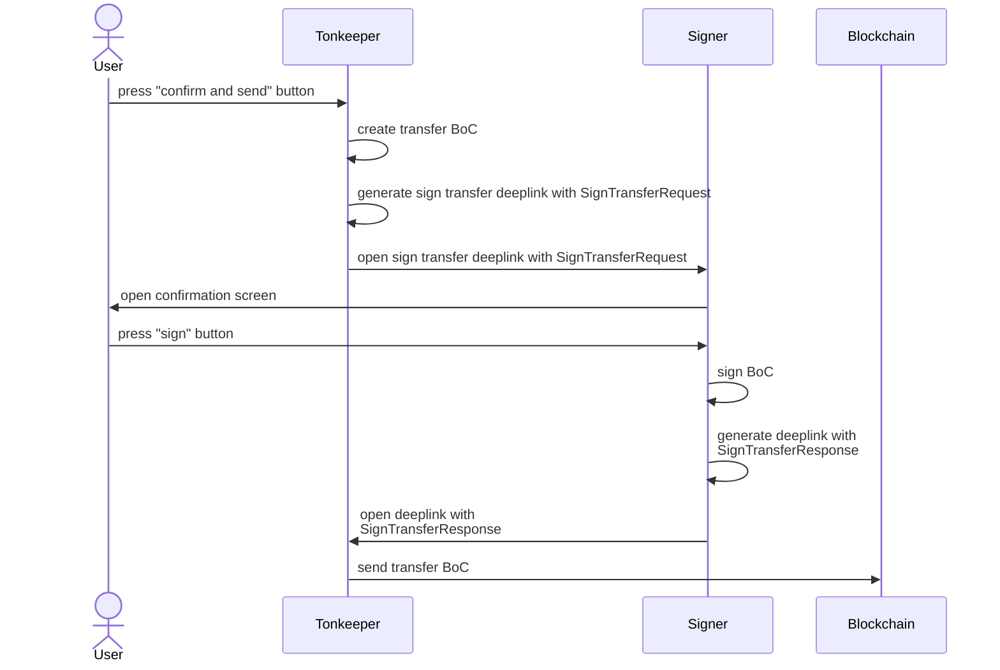
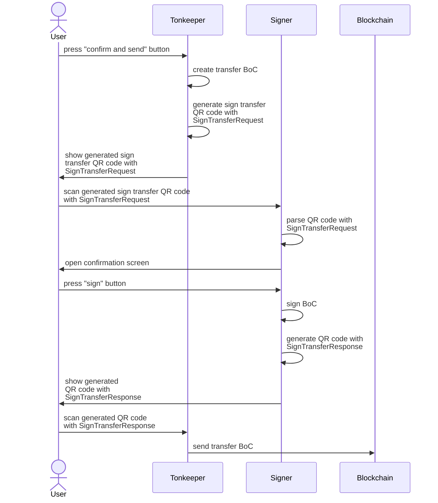

import { Callout } from "nextra/components";

# Signer

<Callout type="warning" emoji="🚨">
  This page is a draft.
</Callout>

Open source secure mobile app for cold managing [TON crypto](https://ton.org/) wallet keys and signing blockchain transactions, designed to operate completely offline.

[Signer GitHub repo](https://github.com/tonkeeper/android/tree/main/apps/signer)

## Features

- Operates offline, compatible with [Tonkeeper](https://tonkeeper.com/).
- Supports multiple keys.
- Enables transaction signing directly within safe area in SignerApp.
- Encrypts keys using your personal password for maximum security.

## Privacy-friendly

- No internet access required, ensuring no data is upload.
- Does not collect analytics or log user activity.
- Encrypts all secure data with your password, making it accessible only to you.
- Private keys never leave app, exported, copied, etc.
- Our developers cannot access your data.

## Secure

The details of the security implementation are described [here](https://github.com/tonkeeper/android/tree/main/apps/signer#security). 

## Decoded payload preview

Allows you to decode and view the contents of a signed payload for the following cases:

- TON transfer with comment
- NFT transfer
- Jetton transfer

## Interfaces

The app works offline and can be on the same device as other apps or on a separate device.

Receiving and sending data can be done via:

- **QR codes**
- **Deeplinks**

## Protocol

### Sign the transaction (from Tonkeeper → Signer)

**Scheme**: `tonsign://v1/`

Parameters marked with an asterisk (*) are required.

| Parameter | Description                                                                                     | Default value                          |
|-----------|-------------------------------------------------------------------------------------------------|----------------------------------------|
| network   | Network (ton, btc, tron20)                                                                      | ton                                    | 
| pk*       | Wallet public key in hex (to immediately select the one you need in Signer)                     |                                        | 
| body*     | Signature data in hex format. Send only body payload.                                           |                                        | 
| return    | URL for returning a signed transaction. more details below. Its default search/query url param. | Signer shows QR code if not specified. | 
| v         | Wallet version TON (v3r1/v3r2/v4r2/v5r1). Using only for UI                                     | v4r2                                   |  
| seqno     |                                                                                                 | 1                                      |
| network   | Ton network version: Mainnet = -239 Testnet = -3                                                | -239                                   |

Example link: `tonsign://v1/?network=ton&pk=5a13667c677535f94d8b365c7952e3b63e069babf8133d93470f8dad8055626d&body=b5ee9c7241010101000a0000100000000000000000768999bf`  
This URL must be included in the QR code.

#### Parameter `return` 

Used to direct the user back to the requester with a signed transaction.

Case: The user on the device opens wallet.tonkeeper.com and signs the transaction via Signer on the same device, he needs to be redirected back to the browser to the specified URL with an additional parameter boc. For example, return back to `https://wallet.tonkeeper.com/?boc=hex`.

Example link: `tonsign://v1/?network=ton&pk=5a13667c677535f94d8b365c7952e3b63e069babf8133d93470f8dad8055626d&body=b5ee9c7241010101000a0000100000000000000000768999bf&return=https://wallet.tonkeeper.com/`

### Return signed transaction (Signer → Tonkeeper)

**Scheme**: `tonkeeper://publish` or `https://app.tonkeeper.com/publish` if opening by click/direct redirect (mainly needed for iOS)

Web wallet use `return` for interaction on one device. Doesn't need a special scheme.

Parameters marked with an asterisk (*) are required.

| Parameter | Description                                                                                     |
|-----------|-------------------------------------------------------------------------------------------------|
| sign*     | Signature of transaction hash in hex. (Result from: PrivateKey.sign(body.hash) )                |

Example link: `tonkeeper://publish?sign=9dfab96f555563f48a641c628ae74168d37f7da1745bfd3cbf1b6013cce5533c03ae59e87c8ebe0146c1d832b797020ac29ff6a1797e7ae7d4b61df89c34540f`  
This URL must be included in the QR code.

### Pairing (Signer → Tonkeeper)

**Scheme**: `tonkeeper://signer/link` or `https://app.tonkeeper.com/signer/link` if opening by click/direct redirection (mainly needed for iOS). For web: `https://wallet.tonkeeper.com/signer/link`.

Parameters marked with an asterisk (*) are required.

| Parameter | Description                                                                                                           | Default value |
|-----------|-----------------------------------------------------------------------------------------------------------------------|---------------|
| network   | Network (ton, btc, tron20)                                                                                            | ton           | 
| pk*       | Wallet public key in hex                                                                                              |               | 
| name      | Key name as url safe string (substitute in the Tonkeeper name input field)                                            |               | 
| local     | We pass true only to open Tonkeeper locally. This way we can determine that Tonkeeper is opened directly from Signer. |               |

Example link for app: `tonkeeper://signer/link?pk=5a13667c677535f94d8b365c7952e3b63e069babf8133d93470f8dad8055626d&name=MyKey`
Example link for web: `https://wallet.tonkeeper.com/signer/link?pk=5a13667c677535f94d8b365c7952e3b63e069babf8133d93470f8dad8055626d&name=MyKey`  
This URL must be included in the QR code.

### QR code specification

Everything in the QR code should always begin with a diagram (`tonsign://` or `tonkeeper://`). This is necessary for proper processing of animation codes.

QR codes for Android:

- Correction level: **M**
- Max size: **256 characters**
- Duration: **100ms per QR-code**

The camera in Android normally reads this size of each code at this speed.

### Interaction diagram

The follow diagrams shows the diagrams for connecting and signing a transaction via signer mobile application:

#### Deeplink linking

#### QR Code linking

#### Deeplink signing

#### QR code signing

